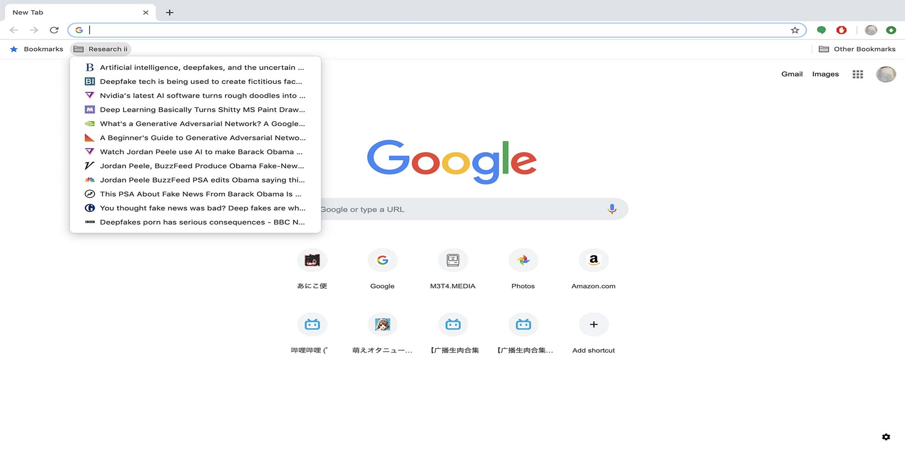
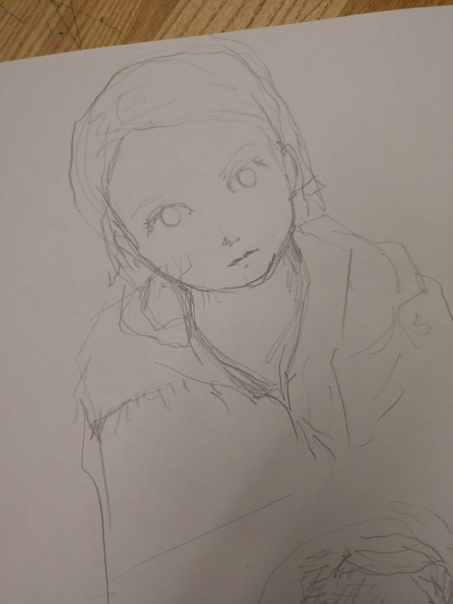
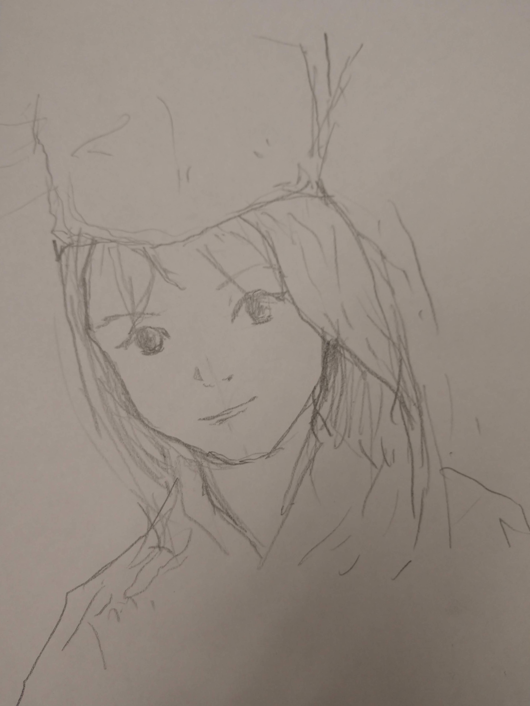
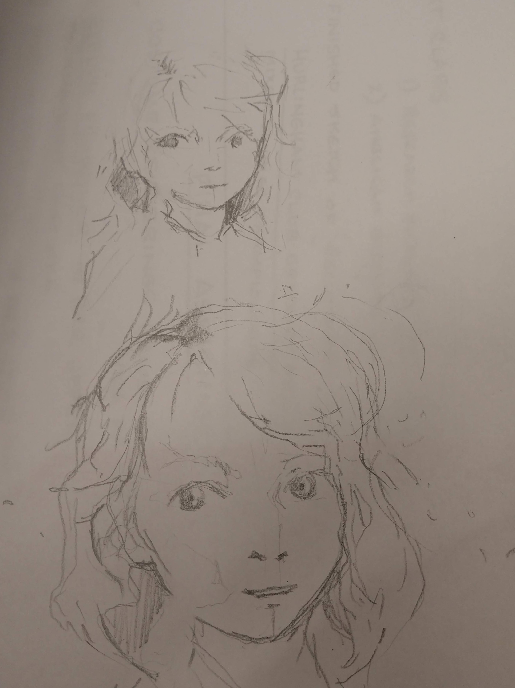

A screenshot as of Wednesdayday April 3rd, 2019

This is a screenshot of my bookmark where I have continued to book mark articles and writings in my process of researching about my topic. I have conducted most of the research online due to the fact that the subject of AI and Deep Fakes take place online. Considering that our prompt was ideas that changed the web" this sounds reasonable.

The relationship seems self explanatory. I have conducted a research to find concepts and ideas that seem interesting to represent in a visual art form. After all, no art comes before history and research.

Below are on going sketches to practice incorporating the style of the AI. In the end, I will make a series of finished renderings done digitally. 

  
