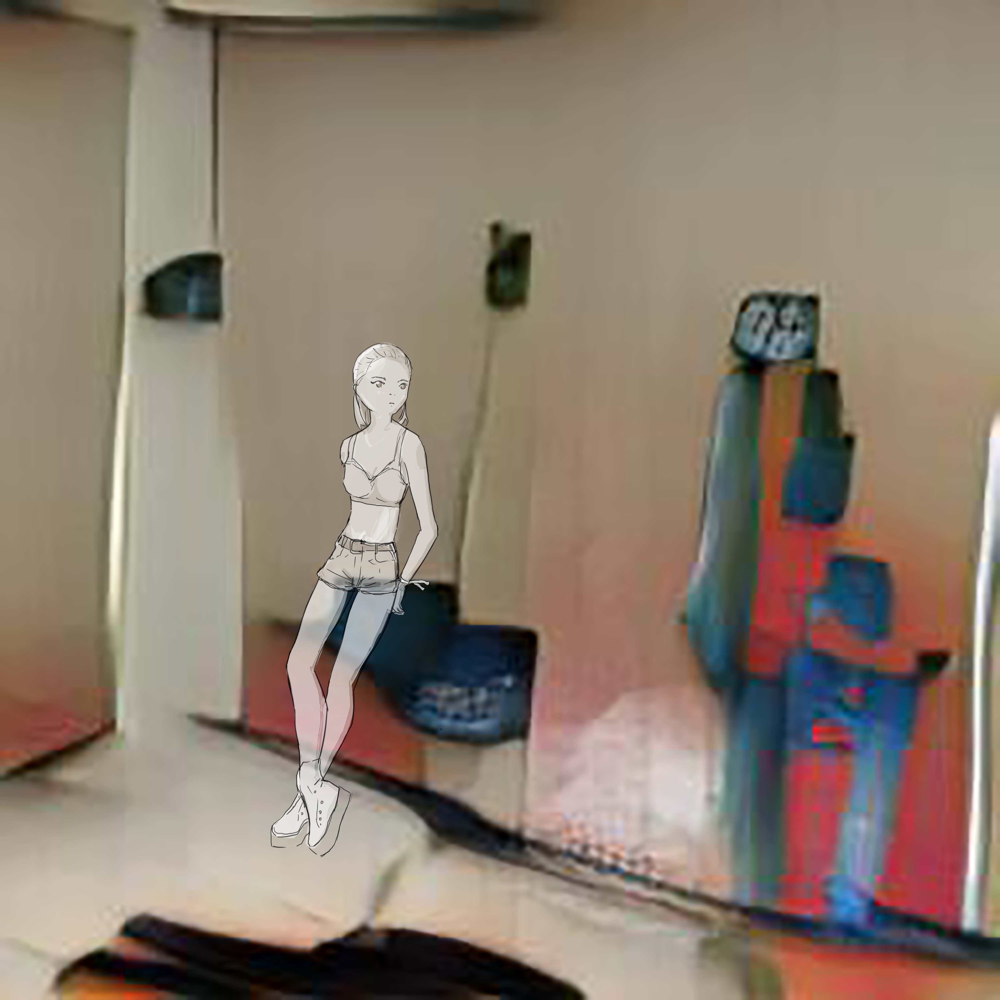
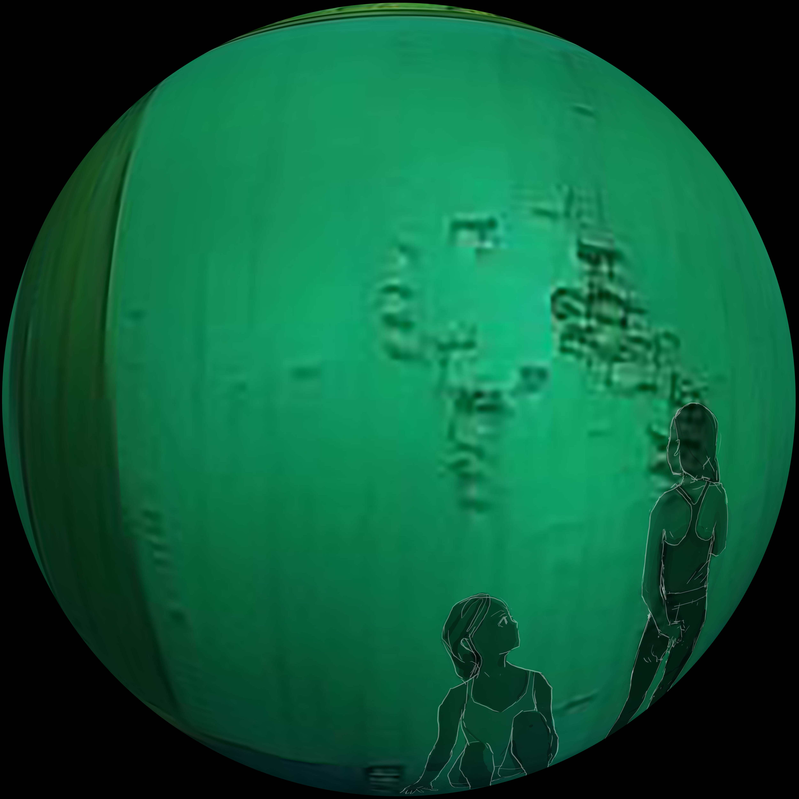

### Idea101

# Deep Fakes

In April of 2018, Buzzfeed released a video of President Obama warning the viewer, “We’re entering an era in which our enemies can make it look like anyone is saying anything at any point in time, even if they would never say those things.” Later in the video, it was revealed that this video was only a digitally manipulated footage of comedian Jordan Parker.  This video served as a warning to the internet users the power of the technology known as *Deep Fakes*. It is a machine learning technology that is able to map a persons face onto another person in a video. It is based on a machine learning technology called Generative Adversary Network, or GAN first propesed by Ian Goodfellow. Where there is a discriminator and the generator. The generator generates images that are inferred from the data fed. The discriminator tries to decide wether the generated image is real or not. The goal is to fool the discriminator as much as possible by making it think the generated image is real.

The term Deep Fake was first introduced in 2017 when a user on the internet billboard *Reddit* introduced clips of celebrity such as Daisy Ridley and Gal Gaddot's face mapped onto porn star's face. The Reddit user called this Deep Fakes. This practice stirred many ethical debates including lawmakers that rushed to send a letter to the Director of National Intelligence to assess the potential threat that this technology possesses. By February 2018, Pornhub banned the distribution of Deep Fakes.

The videos are created by feeding the machine sequence of frames with the face of the person you want to map. The machine analyzes the spatial and temporal information to learn how to map the face. On average it takes about 12 hours to create a minimally convincing video. Many free softwares are available online to create a Deep Fake, the most popular one being *FakeApps* that was developed by the same Reddit user who first introduced the porn footage.

Though this technology is commonly referred with pornography or politics the same technology has been applied for other purpose as well. For example, UC Berkeley has developed a Deep Fake technology that generates fake video of people dancing. It is capable of rendering realistic footage of random people dancing to certain moves like ballet of Bruno Mars.

More recently Nvidia has worked with UC Berkeley and MIT to create a newly improved GAN program that can render photorealistic landscape based on simple blocks of colors. It is expected to be presented at a conference hosted in June.

> A GAN image generated from text, overlapped with an illustration. The idea is to define the abstract space created by GAN to learn to appreciate the aesthetic of machine generated images.
